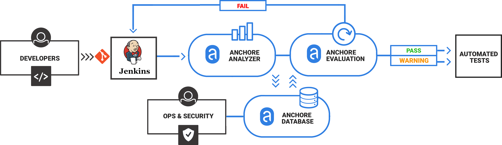
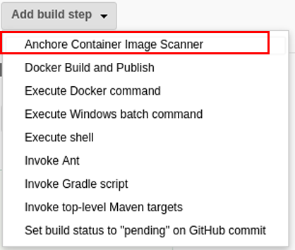
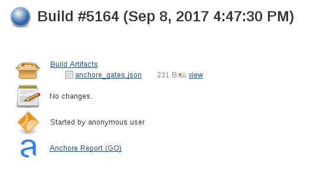
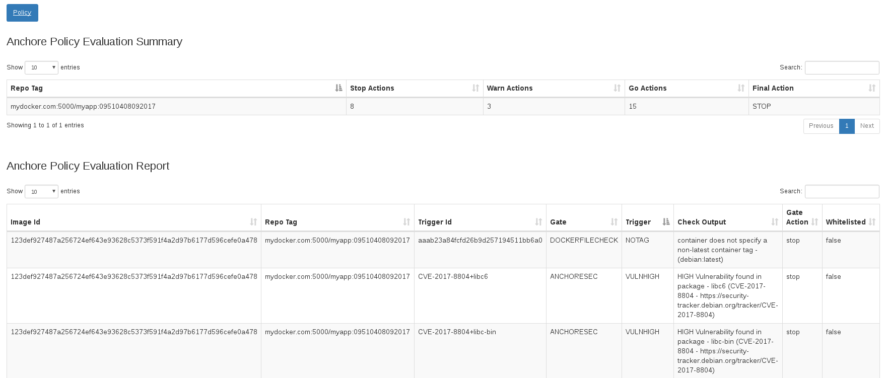

# Anchore Container Image Scanner Plugin

> Older versions of this plugin may not be safe to use. Please review the following warnings before using an older version:
>- [Password stored in plaintext](https://jenkins.io/security/advisory/2018-07-30/#SECURITY-1039)
>- [Credentials stored in plaintext](https://jenkins.io/security/advisory/2019-11-21/#SECURITY-1539)

## Description

Anchore is a container inspection and analytics platform that enables
operators to analyze, inspect, perform security scans, and evaluate
custom policies against container images. The Anchore plugin can be used
in a Pipeline job or added as a build step to a Freestyle job to
automate the process of running an anchore analysis, evaluating custom
anchore policies against images, and performing image anchore security
scans. 

## Anchore Jenkins Plugin

Anchore has been designed to plug seamlessly into the CI/CD workflow. A
developer commits code into the source code management system. This
change triggers Jenkins to start a build which creates a container
image.

In the typical workflow this container image is then run through
automated testing. If an image does not meet your organization’s
requirements for security or compliance then it makes little sense to
invest the time required to perform automated tests on the image, it
would be better to “learn fast” by failing the build and returning the
appropriate reports back to the developer to allow the issue to be
addressed.




## Plugin Usage

The plugin uses Anchore Engine to scan a container image. It interacts with
Anchore Engine over the published API. The usage model generally conforms to 
the following flow:

1.  A Jenkins job will build a container image, and push the image to a
    registry that is pre-configured in the Anchore Engine (see
    pre-requisites below)
2.  The anchore build step will interact with the Anchore Engine by
    'adding' the image (which instructs the Anchore Engine to pull the
    image from the registry), and then performing a policy evaluation
    check on the image. The build step can optionally be configured to
    fail the build if the policy evaluation results in a 'STOP' action.
3.  the plugin will store the resulting policy evaluation results with
    the job, for later inspection/review

The plugin can be used in Freestyle and Pipeline jobs.

### Pre-Requisites

Before getting started

1. Anchore Engine must be installed within your environment, with its 
service API being accessible from all Jenkins workers. 
[Click here](https://github.com/anchore/anchore-engine) to get started 
with Anchore Engine 
2. A docker registry must exist and be configured within Anchore Engine, 
as the plugin will be instructing the Anchore Engine to pull images 
from a registry.
3. All authentication credentials/Anchore Engine API endpoint information
must be available as input to the plugin at configuration time.

Once the plugin is installed, configure the plugin to interact with 
Anchore Engine in Jenkins global settings or at build time.

## Installation

Anchore plugin is published in the Jenkins plugin registry. Follow 
[this guide](https://jenkins.io/doc/book/managing/plugins/#from-the-web-ui) 
and install *__Anchore Container Image Scanner Plugin__*

## Configuration

Configuring the plugin in Jenkins global settings makes it available to any 
Jenkins build using the plugin. The plugin can also be configured at the build
time which overrides the global settings if any. The build time overrides are 
applicable only to the specific build

For global settings, go to the __Manage Jenkins > Configure System__ view and
look for _Anchore Container Image Scanner_ section

- Input _Engine URL_ to point to your Anchore Engine installation  
  >Note: Ensure that the /v1 route is included in the URL
- Input Anchore Engine account username and password for _Engine Username_ and _Engine Password_ respectively 
- (Optional) If the Anchore Engine uses a user created certificate that is not signed
by a standard certificate authority then select uncheck _Verify SSL_
- (Optional) For a verbose log of plugin execution check _Enable DEBUG logging_  

## Adding Anchore Scanning to Jenkins Build

The Anchore plugin can be added a build step for a Freestyle or Pipeline
build. Typically the flow is as follows.

A Jenkins job will:

1. Build a container image
2. Push the image to a Docker Registry, typically a staging registry
    for QA
3. Use Anchore plugin in a Pipeline job or add Anchore Container Image
    Scanner build step to a Freestyle job to instruct the Anchore Engine
    to analyze the image
    1. Anchore Engine downloads (pulls) the image layers from the
        staging registry
    2. Anchore Engine performs analysis on the image
    3. Anchore Engine performs a policy evaluation on the image.
4.The Anchore plugin polls the Anchore Engine for a user defined
    period until the analysis and policy evaluation is complete
5.Based on user configuration, the Anchore pkygub may fail the build
    in the case of a Policy violation or allow the built to continue
    with warnings.

When run, the Anchore plugin will look for a file named _anchore\_images_
in the project workspace. This file should contain the name(s) of 
containers to be scanned and optionally include the Dockerfile. 

### Freestyle 

In the example below an _Execute Shell_ build step is used to build and
push a container image to a local registry.

```
TAG=$(date "+%H%M%S%d%m%Y")
IMAGENAME=build.example.com/myapp
docker build -t $IMAGENAME:$TAG .
docker push $IMAGENAME:$TAG
```

We will add a single line to create the _anchore\_images_ file that is
read by the Anchore plugin

>Note: Multiple lines can be added if the build produces more than a
single container image.

```
TAG=$(date "+%H%M%S%d%m%Y")
IMAGENAME=build.example.com/myapp
docker build -t $IMAGENAME:$TAG .
docker push $IMAGENAME:$TAG

# Line added to create anchore_images file
echo "$IMAGENAME:$TAG ${WORKSPACE}/Dockerfile " > anchore_images
```

After the image has been built and pushed to the staging registry the
Anchore plugin should be invoked. 

Dropdown _Add build step_ and select the _Anchore Container Image Scanner_



A new build step labeled **Anchore Build Options** will appear in your job


The plugin creates an Anchore Report directory that includes a
JSON file with the results of the policy evaluation.

The status of the scan status is indicated in the build summary
(GO = Pass, STOP = Fail, WARN=Warning)



Clicking on the Anchore Report link will render the vulnerabilities
and policy evaluation in the Jenkins web UI



### Pipeline Reference
The sections below describe how to configure the anchore plugin to operate within a Jenkins plugin, and also 
provide some usage examples which illustrate how your team might start using the tool, and some examples of 
how that usage could evolve over time.

#### Root Command
**anchore**: The root plugin command. For specific usage example, see below.

#### Options
- **name**: _Required._ The image list file. This is a required field, but the 'name' key may be ommitted if 
the name value immediately follows `anchore` (see the first example below).
```
anchore 'my_image_file'
anchore name: 'my_image_file'
```

- **annotations**: An optional list of key value pairs to annotate to the images. Omitted by default.
```
anchore annotations: [[key: 'image_owner', value: 'my_team']]
```

- **autoSubscribeTagUpdates**: This option will prompt anchore to periodically rescan the generated docker image 
when there are tag updates.
```
anchore autoSubscribeTagUpdates: true
```

- **bailOnFail**: Fail the build if anchore returns a policy evaluation FAIL result. Default == true
```
anchore bailOnFail: false
```

- **bailOnPluginFail**: Fail the build if Jenkins encounters a critical plugin error Default == true
```
anchore bailOnPluginFail: false
```

- **engineCredentialsId**: The id of the Anchore credentials stored in Jenkins. These are typically set in 
the Jenkins global config, but can be overwritten on a per-job basis as needed.

```
anchore engineCredentialsId: 'my_id',
```

- **engineRetries**: The number of retries on the Anchore scan operation. Default == 300
```
anchore engineRetries: '400'
```

- **engineurl**: The URL of the Anchore instance. This is typically set in the Jenkins global config, 
but can be overwritten on a per-job basis as needed.
```
anchore engineurl: 'myUrl'
```

- **engineverify**: Verify the SSL connection between Jenkins and Anchore. This is typically set in the Jenkins 
global config, but can be overwritten on a per-job basis as needed.
```
anchore engineverify: true
```

- **forceAnalyze**: Force Anchore engine to analyze and, as needed, analyze images it has seen before.
```
anchore forceAnalyze: true
```

- **policyBundleId**: The UUID of the policy bundle to use for image analysis. 
```
anchore policyBundleId: 'a8b6aa90-4097-4f9b-ab5c-da7000776e29'
```

### Pipeline Examples
  >Note: These examples use scripted pipeline snippets, but the specific commands can also be used in declarative 
  >pipeline scripts.
  >
  >These examples take a single, publicly-available image tag ('debian:latest'), put it into a file, and send that 
  >file to Anchore engine for analysis with various analysis options specified.

This first example imagines a scenario where your team is just getting started with Anchore, and anticipates that
the tool will find some issues that will need to be fixed. In order to not block the CI build until those issues 
have been fixed, the `bailOnFail` parameter has been temporarily set to `false`.
```
node {
  def imageLine = 'debian:latest'
  writeFile file: 'anchore_images', text: imageLine
  anchore name: 'my_image_file', bailOnFail: false
}
```

Once the issues identified by the scan have been fixed that parameter should be set (or removed so it can default) 
to `true`. This will help prevent new security issues from being introduced.
```
node {
  def imageLine = 'debian:latest'
  writeFile file: 'anchore_images', text: imageLine
  anchore name: 'my_image_file'
}
```

However, other teams within your organization are now starting to use anchore to analyze the images they are 
building. This has the potential to introduce many more images into the system, but you may want to be able to 
easily generate reports that only highlight the results of scans on your team's images. Annotations are a great 
way to do that! Using annotations, you can easily filter Anchore search results to only return data about the 
images you are concerned with.

To update your pipeline to include annotations on images your team is building, do the following.

```
node {
  def imageLine = 'debian:latest'
  writeFile file: 'anchore_images', text: imageLine
  anchore name: 'my_image_file', bailOnFail: false
}
anchore name: 'my_image_file', annotations: [[key: 'image_owner', value: 'my_team']],
```

As your organization's DevOps maturity progresses, you may find that you not only want to report on image scan 
data from different teams differently, you may also want to customize those scans to more closely control how 
the images you are developing are being scanned.

Information about how to customize policy bundles is available 
[here](https://docs.anchore.com/current/docs/engine/general/concepts/policy/bundles/). To apply a specific policy 
bundle to your image scans, not the unique UUID of your policy and update your pipeline script as shown below.
```
node {
  def imageLine = 'debian:latest'
  writeFile file: 'anchore_images', text: imageLine
  anchore 'my_image_file', annotations: [[key: 'my_key', value: 'my_value']], policyBundleId: 'myUUID'
}
```